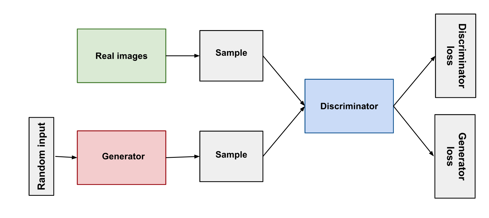

# Agenda

1. Generative AI
2. Large Language Models (LLMs)
3. OpenAI
4. LargeChain
5. Vector Database
6. Llama Index
7. Open Source LLM Model
8. End to End Project

# Generative AI

### Large Language Models

- **Description**: It’s a type of model that predicts the likelihood of a sequence of words. With the advancement in neural networks, modern LLMs like GPT (from OpenAI) and BERT (from Google) are neural-based and extremely powerful.
- **Use Cases**: Text generation, natural language understanding, question answering, and more.
- **Basic Idea**: Given a sequence of words, predict the next word or understand the context. It’s trained on large text corpora to understand and generate human-like text.

- ChatGPT - Product of OpenAI
- Google Bard - Product of Google
- Meta Llama 2 - Product of Meta

### Basics of Deep Learning

#### Artificial Neural Network (ANN)

- **Description**: It is a computing system inspired by the structure of biological neural networks. ANNs consist of layers of interconnected nodes (or “neurons”).

- **Use Cases**: Function approximation, classification, regression, and more.
- **Basic Idea**: Feed input data into the network, process through hidden layers, and get output.

#### Deep Neural Netowrk (DNN)

- **Description**: A subtype of ANNs with multiple hidden layers between the input and output layers. The “deep” in DNN refers to the depth of the network.
- **Use Cases**: Complex tasks like image and speech recognition.
- **Basic Idea**: As data progresses through more layers, higher-level features are learned.

#### Convolutional Neural Network (CNN)

- **Description**: A class of deep neural networks specialized for processing grid-like data such as images. They have convolutional layers that automatically and adaptively learn spatial hierarchies of features.

- **Use Cases**: Image and video recognition, recommendation systems. 

- **Basic Idea**: Use convolution operations to process data in small chunks (like small image patches), making them especially powerful for tasks that have spatial hierarchies, such as images. 

#### Recurrent Neural Network (RNN)

- **Description**: A type of neural network where connections between nodes form a cycle, allowing output from previous steps to influence the current step.

- **Use Cases**: Sequence prediction, time series forecasting, natural language processing.

- **Basic Idea**: Has memory from previous steps to inform the current step. This makes them suited for tasks where temporal dynamics and sequence matter.

#### Out of these, CNNs and RNNs are specialized types of DNNs. While CNNs are designed for spatial data like images, RNNs are designed for sequential data like time series or sentences. LLMs, on the other hand, focus on linguistic data and can be built upon architectures like RNNs or transformers (as in the case of GPT and BERT).

#### Reinforcement Learning

- 

#### GAN

- Can be

# What is Generative AI

Generative AI generates new data based on training sample. Generative model can generate Image, Text, Audio, Videos etc. data as output. Generative AI can be considered as a superset of data

So generative AI is very huge topic
    -
